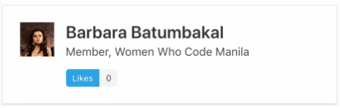
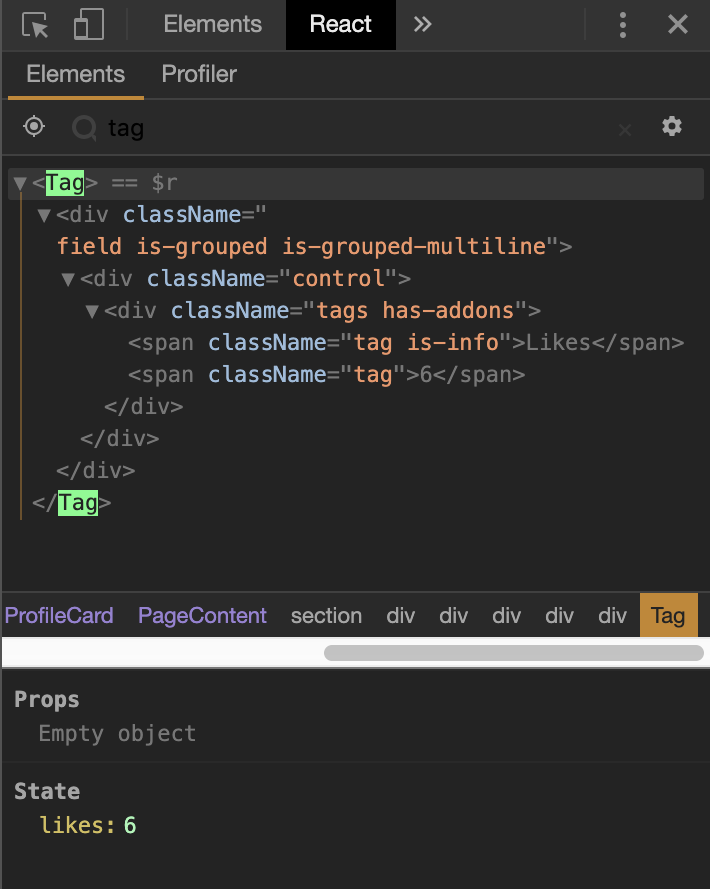

# What is a `state`?

- Influence the output of the render
- Can be updated using `setState()`, causing the component to rerender

# State vs Props

- State is managed `within` the component
- Props gets `passed to` another component
  
# Stateful components

Components containing states are usually called `stateful` components (sometimes they are called `smart components`, `container components`). These components usually contain the logic of a set of components. 

We'll be making a component that renders a button and a number. When the button is clicked, the number will be incremented by 1.

<br>

`Tag.js`
```javascript
import React, { Component } from "react";

class Tag extends Component {
  constructor(props) {
    super(props);
    this.state = {
      likes: 0
    };
  }

  addLike = () => {
    this.setState(previousState => {
      return { likes: previousState.likes + 1 };
    });
  };

  render() {
    return (
      <div className="field is-grouped is-grouped-multiline">
        <div className="control">
          <div className="tags has-addons" onClick={this.addLike}>
            <span className="tag is-info">Likes</span>
            <span className="tag">{this.state.likes}</span>
          </div>
        </div>
      </div>
    );
  }
}

export default Tag;
```

To update the state of a compenent, first we have to declare its initial state. The initial states are declared inside `this.state`. In our example, we have to state that the initial state of likes is `0`.

```javascript
this.state = {
          likes: 0
      }
```

The `addLike` function updates the state of the `likes`. `this.setState()` method is used.

```javascript
addLike = () => {
      this.setState(previousState => {
         return {likes: previousState.likes + 1}
      })
  }
```

Finally, we have to `render()` the state and the button.

```javascript
render() {
    return (
      <div className="field is-grouped is-grouped-multiline">
        <div className="control">
          <div className="tags has-addons" onClick={this.addLike}>
            <span className="tag is-info">Likes</span>
            <span className="tag">{this.state.likes}</span>
          </div>
        </div>
      </div>
    );
  }
  ```

We need to export the component so we can import it to other components (or in the `<App/>`).




# React Dev Tools 

A very helpful tool in checking the states of your components is the [React Dev Tools add on](https://chrome.google.com/webstore/detail/react-developer-tools/fmkadmapgofadopljbjfkapdkoienihi?hl=en) on Google Chrome.

####  